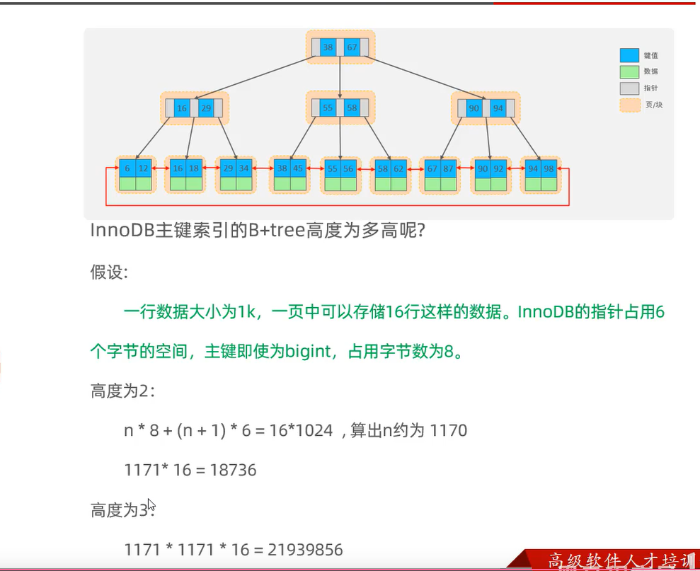
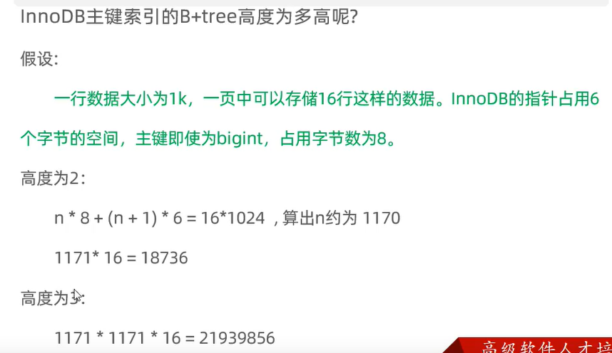
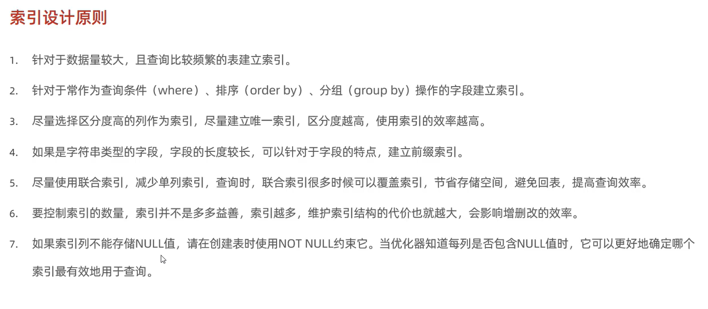
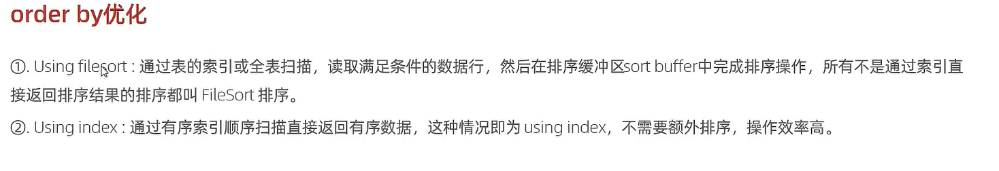

####MySql 
一、事务隔离级别
```html
读未提交 read uncommited 
        A线程读到了B线程在事务中update但没有提交的数据 产生脏读、幻读
读已提交 read commited
        在并发事务中A线程读到数据后加S锁，读完之后释放锁，
        再次读取能够读到被B线程update的数据
可重复读 read repeat
        A线程在读取某行数据时会加S锁，直到方法结束提交事务后才释放S锁，
        B线程不能同事进行锁行更新，所以A线程在自己的事务方法中读到的数据
        前后是一致的，
        在新版中采用MVCC版本控制法，无锁读、更新各自版本
串行
        以串行的方式进行数据的读写，隔离性最强
```


 

二、索引 

  

explain 执行计划
```html
extra:
    using index condition: 查询使用到了索引，但是需要回表查询数据
    using index,using where: 查询使用到了索引，但是需要的数据都能在索引列中找到，所以不需要回表
``` 
 

三、优化
limit
```html
数据量大的时候使用覆盖索引+子查询，先查出分页主键 再用in
```